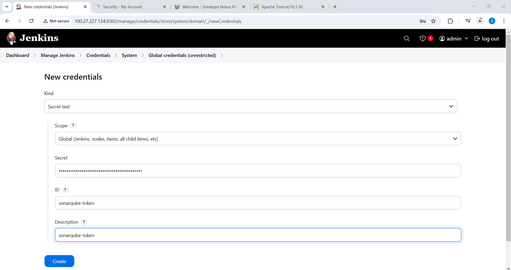

# Automated Java Deployment Pipeline with Jenkins, SonarQube, Nexus, and Tomcat


## Project Overview
I recently completed a DevOps project where I successfully created a Jenkins pipeline to deploy a Java application on a Tomcat server. This pipeline integrates various tools:

- **Jenkins** for CI/CD automation
- **SonarQube** for static code analysis
- **Nexus** for artifact storage
- **Tomcat** for deployment

The project automates infrastructure provisioning using **Terraform** and includes a manual setup option with Bash scripts. The reference diagram and project files are available in the GitHub repository.

---

## Project Steps

### Step 1: Infrastructure Setup
Create four servers for Jenkins, SonarQube, Nexus, and Tomcat using Terraform.

> **Note:** Terraform code is available in the repository for direct installation.

Alternatively, you can set up the servers manually using the following Bash scripts:

#### 1. Install Jenkins
```bash
#!/bin/bash
sudo apt-get update -y
sudo apt install openjdk-17-jdk -y
sudo apt install maven -y
sudo wget -O /usr/share/keyrings/jenkins-keyring.asc \
  https://pkg.jenkins.io/debian-stable/jenkins.io-2023.key

echo "deb [signed-by=/usr/share/keyrings/jenkins-keyring.asc]" \
  https://pkg.jenkins.io/debian-stable binary/ | sudo tee \
  /etc/apt/sources.list.d/jenkins.list > /dev/null
  
sudo apt-get update -y
sudo apt-get install jenkins -y
```

#### 2. Install SonarQube
```bash
#!/bin/bash
sudo apt update -y
sudo apt install docker.io -y
sudo docker run -itd --name sonarqube -p 9000:9000 sonarqube:lts
```

#### 3. Install Nexus Repository
```bash
#!/bin/bash
sudo apt update -y
sudo apt install openjdk-8-jdk -y
cd /opt
sudo wget https://sonatype-download.global.ssl.fastly.net/repository/downloads-prod-group/3/nexus-unix-x86-64-3.78.0-14.tar.gz
sudo tar -xvf nexus-*.tar.gz
sudo mv nexus-3.78.0-14 nexus
sudo /opt/nexus/bin/nexus start
```

#### 4. Install Tomcat Server
```bash
#!/bin/bash
sudo apt update -y
sudo apt install openjdk-13-jdk -y
sudo apt install tomcat9 tomcat9-admin tomcat9-common -y
sudo systemctl start tomcat9
sudo systemctl enable tomcat9
```

---

### Step 2: Access Jenkins and Initial Setup
1. Open Jenkins in a browser and sign in using:
   ```bash
   sudo cat /var/lib/jenkins/secrets/initialAdminPassword
   ```
2. Install suggested plugins after signing in.


### Step 3: Verify Tool Access
- **SonarQube:** `http://<server-ip>:9000`
  - Username: `admin`
  - Password: `admin`
  - 


- **Nexus Repository:** `http://<server-ip>:8081`
  - Username: `admin`
  - Password: `admin123`


- **Tomcat Server:**
  - Update users and roles in `/etc/tomcat9/tomcat-users.xml`

#### Update `tomcat-users.xml`
```xml
<tomcat-users>
    <user username="admin" password="admin123" roles="manager-gui,admin-gui"/>
    <user username="deployer" password="deploy123" roles="manager-script"/>
</tomcat-users>
```
#### Allow Remote Deployment
Update these files:
```bash
$CATALINA_HOME/webapps/manager/META-INF/context.xml
$CATALINA_HOME/webapps/host-manager/META-INF/context.xml
```
Restart Tomcat:
```bash
sudo systemctl restart tomcat9
```

---

### Step 4: Install Required Jenkins Plugins
- Git
- SonarQube Scanner
- Sonar Quality Gates
- Nexus Artifact Uploader
- Deploy to Container


### Step 5: Add Credentials in Jenkins
- **SonarQube:** Generate a token and add it as **Secret Text** in Jenkins.




- **Nexus & Tomcat:** Add username/password in Jenkins global credentials.


### Step 6: Configure Jenkins Pipeline
1. Create a new Jenkins job.
2. Select **Pipeline** as the job type.


4. Configure **Pipeline Script from SCM** and specify the repository.


6. Assign the `Jenkinsfile` path.


8. Save and trigger the build.


### Step 7: Verify Build Success
Monitor Jenkins logs to ensure the build passes.


### Step 8: Pipeline Overview
The pipeline automates:
- **Code Compilation & Static Analysis** (SonarQube)
- **Build & Packaging** (Maven)
- **Artifact Upload to Nexus**
- **Deployment to Tomcat Server**


### Step 9: Final Verification
After the pipeline executes, verify:
- **SonarQube Analysis Results**


- **Artifact in Nexus Repository**


- **Successful Deployment in Tomcat**


---

## Conclusion
This project showcases a fully automated **CI/CD pipeline** for a Java-based application using Jenkins, SonarQube, Nexus, and Tomcat. The process ensures a smooth, scalable, and secure deployment workflow for production environments.

For further improvements, you can:
- Implement **Dockerized environments** for better portability.
- Use **Ansible** for configuration management.
- Add **Monitoring & Logging** using Prometheus & Grafana.

Feel free to explore the repository and contribute! 🚀

